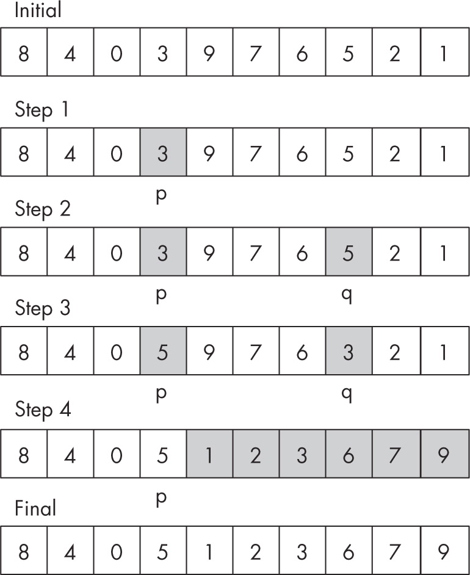

tags:: Programming Books, JavaScript, Data Structures, Algorithms, No Starch Press, Computer Science

- title:: Designing Algorithms
- Chapter:: 5
- book:: [[Data Structures and Algorithms in JavaScript]]
- # 5 Designing Algorithms
	- This chapter covers several techniques for designing 
	  algorithms. We’ll start with recursion, which solves a problem by 
	  breaking it up into one or more simpler cases of the same problem. We’ll
	  also look at *dynamic programming*, which solves a complex problem
	  by solving simpler cases first and storing those solutions to avoid 
	  needless recalculations, as well as the *brute-force* (or *exhaustive*) *search* strategy, where you find a solution to a problem by systematically trying all possible solutions. Finally, we’ll explore *greedy algorithms*
	  that apply a heuristic of choosing the best local option at each 
	  junction of a problem, with the hope that the given methodology will 
	  lead to the solution. Unlike the other strategies mentioned in this list, greedy algorithms may not always arrive at the best solution.
	- The strategies explored here are successfully applied to 
	  develop algorithms used along with data structures for the 
	  implementation of specific abstract data types (ADTs), so focusing on 
	  how to design a new solution for any given problem is worthwhile. The 
	  techniques covered in this chapter aren’t exhaustive, but they lie below
	  the surface in many of the algorithms that we’ll explore later.
	- ## Recursion
		- A function calls itself over and over again. Appears naturally in:
			- ### Mathematics
				- Factorial of a number or Fibonacci series are naturally recursive
			- ### Data Structures
				- List may be empty of consist of a special node, head of the list, followed by another list
				- Tree, consisting of parent node called a root that is connected ot children
			- ### Procedures
				- Several algorithms can be expressed recursively
			- Two kinds of cases:
				- Simple ones that can be solved directly w/out any recursion
				- Complex ones that need to use the function itself as an aid
			- Four step procedure
				- Assume you already have a function that solves your problem
				- Find some simple base cases that you can solve directly without any complications
				- Figure out how you can solve the original problem by first solving one or more smaller versions of it
				- Apply your assumed function from step 1 to solve minor prolems of step 3, or if small enough solve as in step 2
	- ## The Divide an Conquer Strategy
		- Divide problem into smaller versions of itself and conquer it using the solutions to all of them
		- ### Calculating Factorials
			- Factorial of a non-negative number n is defined as: n = 0, 0! = 1, and for n > 0, n! = n x (n - 1)!
			- How many ways can you order n books in a row on a shelf?
		- ### Searching and Traversing
			- binary search and traversing (if there is no tasks you're done, if not go to top of list and do all tasks till your done)
		- ### Considering the Fibonacci Series
			- Series starts w/ 0 and 1, after that it is the series of two previous ones
				- F0 = 0, F1 = 1, and for n > 1, Fn = Fn-1 + Fn-2
		- ### Sorting and Puzzles
			- Tower of Hanoi
	- ## The Backtracking Technique
		- Choose one method of many, and try finding a solution with it. If it succeeds you're done, if you fail backtrack to the point where you made the selection and choose a different option.  If you run out of options, there is no solution
		- ### Finding a Path in a Maze
			- Pseudocode for an algorithm
				- ```
				  ❶ solveMaze(fromCell, toCell, maze, path=[])
				  
				  ❷ if(fromCell === toCell) {
				  
				      return path // success!
				  
				    }
				  
				  ❸ mark fromCell as visited
				  
				  ❹ for all nextCell cells adjacent to fromCell {
				  
				    ❺ updatedPath = solveMaze(nextCell, toCell, maze, path + fromCell)
				  
				      if updatedPath is not null {
				  
				        return path
				  
				      }
				  
				    }
				  
				    // All adjacent cells were tried, and failed...
				  
				  ❻ return null   // failure
				  
				  }
				  ```
		- ### Solving the Squarest Game on the Beach Puzzle
	- ## Dynamic Programming
		- Solve other small problems and store those results so they don't have to be called again when they are needed later
		- Can be:
		- top down ->  Solves problem logically by checking whether its already been solved before dealing with this subproblem
		- bottom up ->  requires first looking at smaller subproblems then solving the original problem
		- Memoization -> Recursive implementations, best for top down
		- tabulation -> bassed on arrays or matrices, best for bottom up DP
		- ### Calculating Fibonacci Series w/ Top Down DP
			- To do this more effectively we need to use memoize to cache previous calcualtions and not repeat the same ones over and over. It first checks an internal cache to see if it was laready made
			- There are packages we can use like npm package [fast-memoize](https://www.npmjs.com/package/fast-memoize)
		- ### Line Breaking with Top-Down DP
			- Let’s look at a practical problem you can solve by applying top-down DP: building a nice-looking web form. Say you want a web page to be able to generate multiple forms onscreen, each with different sets of fields. If you had a fixed number of forms with predetermined, fixed sets of fields, it wouldn’t be a problem. However, in this case, the number of forms grows unpredictably, and fields need to be added or removed, as well as moved around, so you need a more flexible solution. What you need is a “form creator” that takes in a list of fields in a given order and produces a suitable form as output. For instance, a part of the form to be generated might look like the one shown in Figure 5-7.
			- Figure 5-7: An example web form
			- The problem is you want a justified right margin, but the widths of the fields are inconsistent, so you’ll need to break rows and stretch some fields to make everything even. You need to be careful when deciding where to break rows and what fields to put in each row.
			- NOTE
			- The TeX typesetting system implements the Knuth-Plass algorithm to determine line breaks for paragraphs so they look nice. The problem here is essentially the same, but we’ll use DP to solve it instead.
			- Consider five fields of widths 7, 2, 5, 3, and 6 (see Figure 5-8). You need to arrange them in rows of width 10.
			- Figure 5-8: Example fields with various widths
			- You can’t manage with fewer than three rows, and having four or more rows results in too much wasted space (although we’ll need to quantify this concept later). You won’t add white space between fields (as TeX does between words); instead, you’ll expand the fields themselves. First decide how much empty space to leave in each row before expanding blocks or separating words. You have three possible layouts of three rows (see Figures 5-9, 5-10, and 5-11; blocks in gray represent extra added white space at the end of rows; you’ll have to share that space among all blocks in the same row).
			- Figure 5-9: Field layout 1
			- Figure 5-10: Field layout 2
			- Figure 5-11: Field layout 3
			- What solution is best? Assuming that adding smaller spaces in many rows is better than adding larger spaces in fewer rows, consider the “row cost” to be the square of the added white space for that row, and the total cost will be the sum of all the row costs. (To better understand why squaring is used, imagine you need to add two spaces; putting all of them on the same line would cost 22 = 4, but placing one space in each of two lines would cost 12 + 12 = 2, so squaring the costs before adding them implements a policy that favors smaller spaces.) Given this definition, the cost of the layouts would be 12 + 22 + 42 = 21, 32 + 02 + 42 = 25, and 32 + 32 + 12 = 19, so the third diagram represents the design the algorithm should produce. Let’s program it.
			- Consider a list of block widths (which in this case would be 7, 2, 5, 3, and 6) and a maximum width (MW) to achieve. The following logic would work: calculate the sum s of all widths, and if s is not greater than MW, the cost is (MW – s)2. You can’t make it better by splitting the list into two or more rows. Otherwise, if you have more fields than you can fit in a single row, you can try splitting the list into two fragments in all possible ways and then choose the split that produces the lowest cost.
			- The following logic does that, but it leaves out the code to distribute white space among the fields in a row, since that’s only needed later. This code finds the cost of the best set of line breaks and where those breaks should be made:
			- The function finds the best split for a set of blocks from p through q, inclusive, and also returns the list of splits to be made. Assume we have a totalWidth(x,y) function that calculates the width of blocks x through y (you’ll see how to best implement it later). First calculate the width of the whole list of blocks ❶; if it’s less than the available space, you won’t need any splits and you are done. Calculate the cost per the definition and return that a split is done after the q position ❷. If you need a split, set up a search; optimum will be the best possible cost ❸, and split will be the place to split the list ❹. Loop through all possible breaks ❺ and find the costs of fragments p through r and fragments r + 1 through q ❻. The cost of each split is stored ❼, and if it’s better than the previous optimum ❽, r is preferred as the new split. The end result ❾ is the best cost found, together with the list of split points.
			- Figure 5-12 shows how this algorithm would deal with your list of blocks.
			- Figure 5-12: All the possible splits evaluated by the algorithm
			- Calculating costs, Figure 5-13 shows the optimum solution.
			- Figure 5-13: The optimum solution
			- The cost is shown underneath each block. If a block is split into several blocks, its cost is the sum of the costs of its parts. The highlighted path shows how to achieve the optimum solution: leave 7 on its own in the first row, place 2 and 5 in the second row, and place 3 and 6 in the last row, for a total cost of 19. Running the algorithm produces the following result:
		- ### Calculating Fibo with Bottom Up
			- With bottom up, we start at 0 and then 1, and then go up, calculating fibonacci this way instead of Top Down -> calculations don't have to be recalculated and stored the same way so we can just loop straight through and calculate much easier
		- ### Summing Ranges Recursively with Bottom Up DP
		- ### Summing Ranges by Precomputing Bottom Up Dp
			- You could use an internal cache to precompute all the values (partial) and all queries would be O(1)
			- We're using a closure for the partial array initialized in an immediately invoked function expression IIFE.
			- Trying two different ways to approach this problem has eventually gotten us to an O(1) runtime.
	- ## Brute Force Search
		- Tries to systemically find a solution by trying all possible solutions one by one until you find it. Very inefficient as it becomes factorial and exponential
		- ### Detecting Tautologies
			- In terms of logic, a tautology is a boolean expression that is always true. For instance, if X, Y, and Z are boolean variables, two of the following JavaScript expressions are tautologies:
				- X OR Y OR (NOT X AND NOT Y)
				- X OR (NOT X AND Y) === X OR Y
				- (NOT X) OR (X AND Z) OR (NOT Y) OR (Y AND Z) OR Z
			- Even for readers well versed in logic and expressions, it 
			  may not be immediately obvious which of these expressions are always 
			  true.
			- Recognizing whether a function of *n* boolean parameters is a tautology potentially requires 2*n* tests for each possible combination of true/false values, verifying for each one whether the function produces true as its result.
			- Alternatively, you could try to find some combination of arguments that 
			  would make it false, and upon finding such a case, you’d know that the 
			  function isn’t a tautology. That kind of search would require a logic 
			  similar to what you used to solve the Squarest Game on the Beach puzzle.
			- Using recursion comes in handy: if a function of *n* 
			  variables is a tautology, setting the first variable to false should 
			  also be a tautology, and the same would happen if the first variable 
			  were set to true. To see whether the original function is a tautology, 
			  you need to test a couple of functions with one fewer argument, which 
			  leads to a simple implementation:
			- The isTautology() function receives the original function to test, fn, and a list of arguments ❶.
			   The latter will be the combination of values with which you’ll test 
			  whether the function is true. If you have the right number of arguments ❷, you evaluate the function ❸, and if it produces a false value ❹,
			   you’ll log the fact and return false, which will short-circuit all 
			  future and pending evaluations. If the function returns true, the search
			   will continue. If not enough arguments were provided ❺,
			   you’ll test the function twice: adding a true and adding a false to the
			   list of arguments, so all combinations will be tested eventually.
		- ### Solving Cryptoarithmetic Puzzles
			- Puzzles that have been replaced by letters of the alphabet. Goal for the solver is to find which letter stands for which digit. Usually no numbers may start with zero, all letters hsould have different values, and the equation should translate to a phrase that makes sense.
				- 
			- You could solve this sort of puzzle with careful analysis (see question 5.7 for another example), but here you will write a solver that goes through all possible combinations of digits, checking whether any work. 
			  In this example, given that there are 10 digits, you need to check 10! (3,628,800) combinations, but some puzzles have numeric bases other than 10, so in general, this is an *O*(*n*!) algorithm. A similar example (in terms of its solution) is the traveling salesman problem that provides a list of *n* cities and the distances between each pair of cities; you need to find the shortest possible route that visits each city only once, returning to the starting city. The solution to this is likewise *O*(*n*!), and the algorithm is similar to the one you’ll see next. (You’ll also 
			  see a different type of solution using a greedy algorithm for this problem, later in this chapter.)
			- What algorithm do we need? The idea is simple: try all combinations of digits from 0123456789 to 9876543210, and check for each one whether the puzzle is solved. (In this case, you’ll use only the first eight digits, but that really doesn’t change anything.) You could design the main logic as follows, assuming that puzzle() is a function to test whether a combination is valid:
			- The digits parameter ❶ will have the set of digits that you’ll use for the problem; although in this case, 0 to 9 are the possible values, you may as well write code that could be used for cryptarithmetic puzzles in other bases. Make a local copy of the set of digits ❷ to avoid modifying the original argument and to avoid a side effect (as discussed in Chapter 2), and sort it to go through the combinations in ascending order. Then set a loop ❸ that will exit when you either find a solution or decide none exists. If the current combination of digits works out ❹, log it and exit; otherwise, generate the next combination of digits ❺ and keep looping, unless you reach the last combination, and then you’ll know that the problem has no solution.
			- Generating the next permutation of a given set is a 
			  well-known algorithm, likely discovered by Indian mathematician Narayana
			  Pandita in the 14th century. Assuming that the current permutation is 
			  stored in array d, it requires four steps, in order:
			- 1.	Find the rightmost index p such that d[p] < d[p + 1]; if no such p exists, you were already at the last permutation, and the algorithm finishes.
			- 2.	Find the rightmost index q such that d[p] < d[q]; d[q] is the least value to the right of d[p]greater than it.
			- 3.	Swap the values of d[p] and d[q]; now the values from d[p + 1] to the end of d will be in descending order.
			- 4.	Reverse the list of values from d[p + 1] to the end of d.
			- 
			- Step 1 sets p to point at 3, because 3 < 9; all other elements from the right (976521) are in descending order. Step 2 sets q to point at 5, the least value to the right of 3 that is greater than it. Step 3 swaps the values pointed by p and q; values to the right of p are again in descending order (976321). Step 4 ends by reversing the values to the right of p, which end in ascending order (123679), and you get the next permutation: 8405123679.
			- With this logic, you can see the complete version of the 
			  cryptarithmetic puzzle solver by adding the code to generate permutations:
			- The function is called with all 10 digits ❶, but you use only the first 8, ignoring the last 2. If a leading digit is 0 ❷, the solution isn’t valid, so reject that out of hand. If there are no leading zeros ❸, compute the values of the three words (SEND, MORE, and MONEY) and we check whether they fulfill the original equation. Given this function, all you need to do is pass it to the solve() function ❹ and wait (very little) for the solution to appear.
	- ## Greedy Algorithms
		- A set of algorithms that may not always work because they always attempt to make the best choice at every time they have to make a choice. They ensure the algorithm proceeds quickly without having to backtrack at the expense of accuracy. It doesn't necessarily always make the best choice because it doesn't look far enough ahead. In the right circumstances, they do work, but other times they don't.
		- ### How to Make Change
		- How do you make change with the fewest bills and coins? With greedy algorithms you follow a simple rule - at each step choose as many as possible units of the largest possible denomination and keep going until you're done.
		- For $229.60
			- Start by using two $100 bills, then one $20, then a $5, four $1s, two quarters, and a dime. No other solution has fewer bills and coins -> This greedy algorithm will always succeed, depending on the available denominations.
		- ### The Travelling Salesman Problem
			- Requries a brute-force search but a greedy algorithm solves it well. Imagine a salesman has to do a tour, visiting a city on a list once and then returning to a starting point - this is called a Hamiltonian cycle. Distances (or costs) for traveling between cities is known. What is the cheapest way to achieve the task?
			- A greedy algorithm for this problem (might not find the best solution, but performs quickly) would proceed as follows: at each step visit the nearest not-yet-visited city. Under certain circumstances, it might find the optimal solution.
		- ### Minimum Spanning Tree
			-