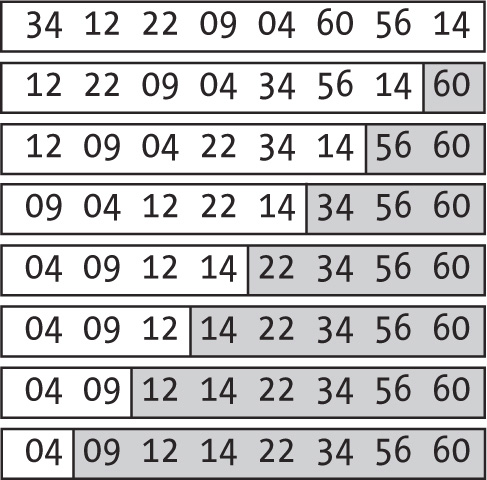
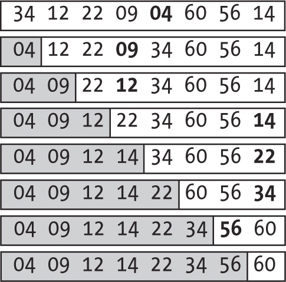
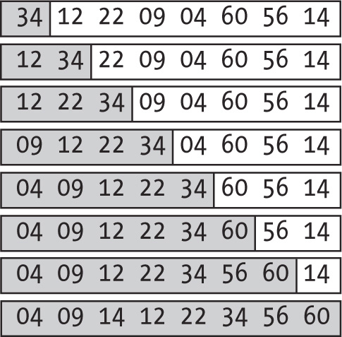
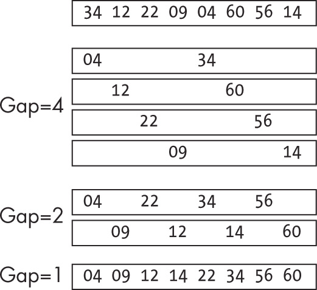
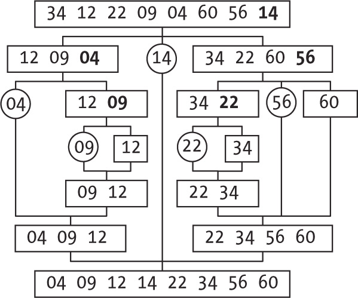
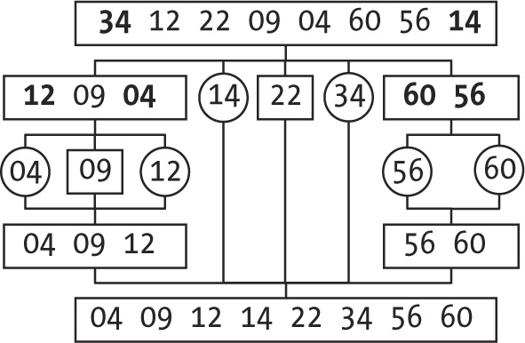
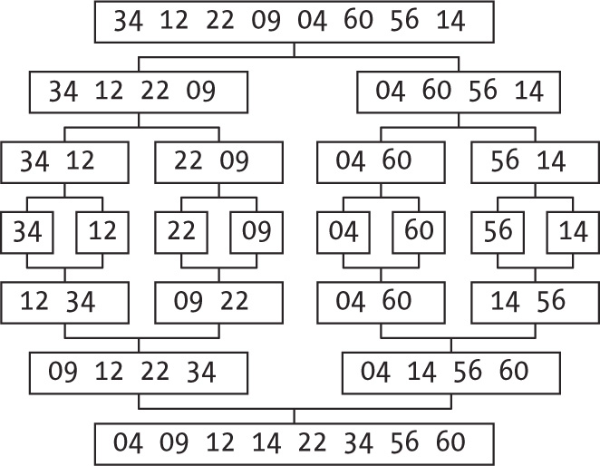
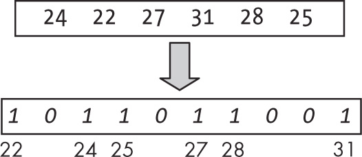
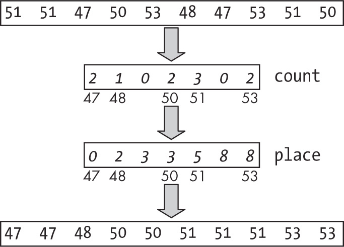

tags:: Programming Books, JavaScript, Data Structures, Algorithms, Computer Science, No Starch Press

- title:: Sorting
- Chapter:: 6
- book:: [[Data Structures and Algorithms in JavaScript]]
- # 6 Sorting
	- How to sort a set of records into order, where each record consists of a key (alphabetical, numerical, or several fields) and data. The algorithm's output should include the exact same set of records, but shuffled so that the keys are in order. Usually keys are in ascending order, but descending order requires only a minor change in sorting algorithms
	- ## The Sorting Problem
		- A sorting algorithm is an algorithm that given a list of records containing a key and some data, reorders the list so that the keys are in non-decreasing order (no key is smaller than its preceding key) and the output list is a permutation of the input list, retaining all original records.
		- ### Sorting Stability
			- Maintains same order as the input in terms of where keys and elements end up in sorting algorithm -> if one element preceded another and both  had the same key, in the ordered input, the first one will precede the second
			- You can add an extended key to make sort more stable
		- ### JavaScript's Own Sort Method
			- https://developer.mozilla.org/en-US/docs/Web/JavaScript/Reference/Global_Objects/Array/sort
			- Given an array, the sort method reorders the array in place using an optional comparison function (toSorted - newer method - doesn't sort in place but instead produces a new sorted version of the array.)
				- If no function is provided, JavaScript converts elements to strings and then sorts lexicographically
				- ```javascript
				  const a = [22, 9, 60, 12, 4, 56];
				  a.sort();
				  console.log(a);
				  ```
			- To accomodate we need to provide a function that will return two elements, a and b, and return a negative value if a should precede b, positive value if a should follow b, and zero if both keys are equal and if a and b can be in any order - its an easy fix
				- ```javascript
				  const a = [22, 9, 60, 12, 4, 56];
				  a.sort((a, b) => a - b);
				  console.log(a);
				  ```
			- Check out `complexSortMethod.js`
				- The data to sort ❶ has dates as three separate fields (d, m, and y, for day, month, and year) and name (n). If two persons are from different years ❷,
				  you return the correct negative or positive value by subtracting years.
				  If the years are equal, you can compare months with the same kind of 
				  logic ❸, and if the months are also equal ❹, you do the same once more for days. If the dates are equal, you resort to comparing names ❺, and since you cannot use math and just subtract dates, you need to make actual comparisons, date part by date part. The final return 0 is done ❻ only if all fields were compared and found to match.
				- If you sort the people array with the dateNameCompare(...) function you just wrote, you get the expected result:
				- Finally, consider stability. Originally, the specification for the .sort(...)
				   method didn’t require it, but ECMAScript 2019 added the requirement. Be
				   aware, however, that if using an earlier JavaScript engine, you cannot 
				  assume stability, so you might have to resort to the solution described 
				  in “Sorting Stability” on [page 93](https://learning.oreilly.com/library/view/data-structures-and/9798341620001/xhtml/chapter6.xhtml#pg_93). Also, keep in mind that any given engine may just not correctly implement the standard.
		- ### Sort Performance
			- If you are comparing elements to sort an array, its indirectly implied that you're deciding on what was the original permutation. Well-place questions divide the range of options in half, so you need to know how many questions are needed for n! possibilities -> Equivalent ot asking how many times you should divide n by 2 until you get down to 1.
			- The answer is log n!, in base 2. Stirling's approximation says that n! grows as n^n, so logarithm of n! is O(n log n). It will always be at least  O(nlogn) with no better results, but possibly worse results.
	- ## Sorting with Comparisons
		- Each method we will try will get better in terms of optimal performance as we go on
		- ### Bubbling Up and Down
			- Easy to implement and only for smaller sets of data
		- ## Bubble Sort
			- 
			- All sorting functions share the same signature: an array to sort (arr) and the limits for sorting (from, to) that, by default, will be the array’s extremes ❶. The outer loop ❷ goes from the right to the left; after each pass, the element in position j of the array will be in the right place. The inner loop ❸ goes from the left extreme to the right up to (but not reaching) the outer loop j; you compare each element with the next ❹, and if the second is smaller, you swap them.
			- You can improve performance in most sorted arrays (a not 
			  uncommon case) by checking whether any swaps occurred on each pass through the array. If none were detected, it means the array is in order.
			- The performance of this algorithm is *O*(*n*2), which is easy to calculate. First count comparisons: the first pass does (*n* – 1) comparisons, the second pass does (*n* – 2), the third (*n* – 3), and so on. The total number of comparisons is then the sum of all numbers from (*n* – 1) down to 1, which is *n*(*n* – 1) / 2, so *O*(*n*2).
	- ## Sinking Sort and Shuttle Sort
		- Sinking sort is similar to bubble sort, but instead of greatest values moving to the end of the array, the lowest values quickly sink to the beginning of the array, but it takes longer for the greatest values to go to their places
			- We can alternate a pass of bubbling and a pass of sinking to get an enhanced algorithm called a shuttle sort (cocktail shaker or bidirectional bubble sorts)
			- Starting with the same elements, the first pass is the same as bubble sort's, moving 60, which is the greatest value in the array to the rightmost position. The second pass goes right to left and moves 04 the smallest value in the array to the leftmost position. The third pass again goes left to right and moves 56 to its place. After that it goes right to left, left to right, and so on.
			- `shuttleSort.js`
				- As mentioned earlier, the signature for this sort function is always the same: an array to sort and the portion to put in order ❶. You have two variables ❷ that mark how far to the left and right the array is already sorted: f (as in *from*) starts at the left and grows by 1 after each right-to-left pass, and t (as in *to*) starts at the right and decreases by 1 after each left-to-right pass. When these variables meet ❸, the sort is done. You perform a left-to-right pass as shown earlier ❹, and then you decrement t ❺, since you’ve placed a new value in the right place. After this pass, you do the same ❻, but right to left, and you increment f ❼ to finish.
				- The algorithm is still *O*(*n*2), but the actual 
				  implementation typically is double the speed or even better if you 
				  include testing for swaps (see question 6.7). In any case, it’s easy to 
				  show that it can’t do any worse, for in each pass, it places one number at its final position, so after having placed (*n* – 1) numbers at their place, it will be done, the same as bubble sort.
		- ### Sorting Strategies for Sorting Cards
		- ## Selection Sort
			- Look for the lowest card and place it farthest to the let in your hand. Then look for the next lowest card and place it after the first and keep doing that, always selecting the lowest remaining card and placing it next to the already sorted cards.
			- 
			- In the first pass at the top, you find that the minimum number is 04, 
			  and you do a swap to move it to the first place in the array. The second
			   pass finds 09 and swaps it with 12, so you now have two numbers in 
			  order. The process continues the same way; an exception is in the 
			  next-to-last line, in which no swap is needed because 56 was already in 
			  the correct place.
			- `selectionSort.js`
				- Go in order ❶ from the first place in the array to the last. The m variable ❷ keeps track of the position of the minimum value already found. As you loop through the yet unsorted numbers ❸, if you find a new minimum candidate ❹, you update m. After finishing this loop, if the minimum isn’t already in place ❺, do a swap.
				- The order of this algorithm is, again, *O*(*n*2). You have to look at *n* elements to find what should go in the first place; then look at *n* – 1 for the second place, *n* – 2 for the third, and so on. You already know this sum is *O*(*n*2). The algorithm in the next section is also based on how you’d sort playing cards, but it has slightly better performance.
	- ## Insertion Sort
		- This time lets take the first card, which is clearly in order by itself. Next look at the second card and either place it before the first if it's lower or leave it where it is if it's higher. Now you have two cards in order. Look at the third card and decide where it should go among the previous two. Place it there. Insert in between cards that you have already sorted.
			- 
			- Start with a single card in order, in this case, number 34. Then 
			  consider the next value, 12, and place it to the left of 34, so the two 
			  numbers are in order. Then consider 22, which goes between 12 and 34, 
			  and now three values are ordered. Continue working this way, always 
			  inserting the next number where it belongs among the previously sorted 
			  ones, until you reach the last line. After placing 14 among the already 
			  sorted numbers, the whole array becomes ordered.
			- Set up a loop that starts at the second place in the array and goes to the end ❶, and loop back as long as the list isn’t in order ❷, swapping to get new numbers in place ❸.
			- Looking at this carefully, you’ll notice it’s doing too many swaps to get the new element to its place.
			- You can quickly optimize the code to avoid that and do just one swap per loop:
			- The first loop ❶ is exactly the same as earlier, but the difference lies within. You set
			  the number to be inserted among the previously sorted aside ❷, and you loop to find where it should go ❸, pushing values that are greater to the right. At the end ❹, you place the new value in its final position.
			- Insertion sort is a simple algorithm, which makes it a 
			  good choice for smaller arrays. Later in the chapter we’ll look at how 
			  it’s sometimes used in hybrid sorting algorithms as a replacement for 
			  theoretically more convenient, but practically slower, alternative 
			  methods.
	- ## Making Bigger Jumps with Comb and Shell Sort
		- The idea of swapping elements and making the bubble up or sink down isn't bad, and applying the idea of making larger jumps (swapping elements that are farther apart) eventually leads to a better algorithm, shell sort. The variant that is combined with bubble sort variant is comb sort
	- ## Comb Sort
		- Lets look at bubble sort and consider how keys move in an array like rabbits and turtles. Rabbits represent the large values near the beginning o fthe list which quickly move to their new places at the end of the array, swap after swap. On the other hand, turtles represent the small values near the end of the list, which slowly move to their places in a single swap per pass
		- We can perform some passes with swaps, but instead of comparing one element with the next one, we'll consider larger gaps. Rabbits will jump further distances toward the right, but turtles will correspondingly jump further distances toward the left.
		- It has been determined empirically that the first gap should equal the array’s length divided by 1.3, the “shrink factor” ❶, and successive gaps will always be 1.3 times smaller ❷. When the gap becomes 1 ❸, just apply bubble sort, and you’re done. While the gap is greater than 1 ❹,
		  you do what’s essentially the central logic of bubble sort, but instead
		  of comparing elements one place apart, you compare elements gap places apart.
		- Comb sort usually performs better than bubble sort, but it’s still *O*(*n*2) in the worst case and becomes *O*(*n* log *n*)
		  in the best case. However, that’s not why we’re considering this idea; 
		  rather, the concept of sorting elements that are far apart provides real
		  benefits, and you’ll see that Shell sort that does exactly that in a 
		  way similar to comb sort.
	- ## Shell Sort
		- 
		- In the first pass, we do an insertion sort, but for elements set four places apart, which leads to an array consisting of four short-ordered sequences. Then lower the gap size to 2 and repeat the sort. The array now consists of two ordered sequences. Eventually you'll reach gap size of 1 and you'll just do an insertion sort because of the previous partial sorts with fewer comparisons or swaps as the normal algorithm which is the advantage of shell sort.
		- First select what gaps to use ❶,
		   keeping in mind that the last one to be applied must be 1. You’ll find 
		  many suggestions online as to which sequence to use, but this example 
		  will use Knuth’s proposal (1, 4, 13, 40, 121, . . . , with each term 
		  being triple the previous one, plus 1), which leads to an *O*(*n*1.5) algorithm. Then, you take gaps in decreasing order ❷ and essentially do an insertion sort ❸ but for elements gap spaces apart ❹.
		   With larger gaps, you’re ordering sequences of fewer elements, but as 
		  you decrease the gap size, you deal with longer sequences that tend to 
		  be almost in order, so insertion sort behaves well.
	- ## Going for Speed with Quicksort
		- These algorithms will now achieve the O(n log n) theoretical speed limit - the worst being a quadratic performance
	- ## Quicksort
		- Partition-exchange sort was created by Tony Hoare in the 1960s as a divide and conquer algorithm with high speed
		- Select a pivot element from the array to be sorted and redistribute all the other elements into two subarrays, according to whether they are smaller or larger than the pivot. The array ends with lower values first, then the pivot, and then the higher values. The each subarray is sorted recursively and when it's done, the whole array is sorted.
		- 
		- Let’s say we always choose the rightmost element of the array as the 
		  pivot. (It won’t prove to be a very wise option, as you’ll see.) In this
		   case, the first choice is 14, and you rearrange the array so all values
		   less than 14 come first, then 14 itself, and finally all values greater
		   than 14. The same procedure (select the pivot, rearrange, and sort 
		  recursively) is applied to each subarray until the whole array is 
		  sorted.
		- First, check whether there’s actually anything to sort; if the left pointer is equal to or greater than the right one, you’re done ❶. The rightmost element will be the pivot ❷. Next, go through the array from left to right ❸
		  in a fashion reminiscent of the insertion sort, exchanging elements if 
		  needed so smaller elements move to the left, greater ones to the right, 
		  and the pivot ends at position p ❹.
		  It would be a good idea to simulate a run of the pivoting code by hand.
		  Despite its short length, it’s a bit tricky to get right. (What happens
		  if the pivot value appears several times in the array? See question 
		  6.10.) Finally, apply recursion to sort the two partitions ❺.
		- Analysis shows that *on average*, quicksort works in *O*(*n* log *n*)
		  time. However, the worst case is easy to find. Consider sorting an 
		  already sorted (in ascending or descending order) array. Examining the 
		  code shows that partitioning will always end with just one subarray, and
		  you’ll have the equivalent of a selection sort or bubble sort, which 
		  means performance goes down to *O*(*n*2). But you can fix that.
		- ### Pivot Selection Techniques
			- Choosing the pivot can have a serious impact on the quicksort performance. Always choosing the largest or smallest element in the array will have a negative hit in speed.
			- Randomly choose pivot -> select a random position between left and right inclusive and if needed swap the selected element to move it to the rightmost position so we can move on with the rest of the algorithm with no further changes
			  logseq.order-list-type:: number
			- We’ll look at random selection in more detail in [Chapter 8](https://learning.oreilly.com/library/view/data-structures-and/9798341620001/xhtml/chapter8.xhtml), but the way you calculate iPivot (the position of the pivot) ❶ selects a value from left to right
			  inclusive with equal odds. The rest of the sorting algorithm assumes 
			  that the chosen pivot was at the right of the array, so if the chosen 
			  pivot is elsewhere ❷, just do a swap.
			- This random selection solves the worst-case behavior for 
			  almost-sorted arrays, but there’s still the (assuredly low) probability 
			  that you’ll always just happen to pick the highest or lowest value in 
			  the array to be sorted, and in that case, performance will suffer.
			- What’s the ideal pivot? Choosing the array’s median (the 
			  value that splits the array in two) would be optimum. A rule that comes 
			  close is called the *median of three*: choose the median of the left, middle, and right elements of the array:
			- Testing this code with all possible permutations of three values shows that arr[right]
			  always ends with the middle value. Even better, you might pick the 
			  “ninther,” defined as a “median of medians”: divide the array in three 
			  parts, apply the median of three to each third, and then take the median
			  of those three values.
			- You can help quicksort become faster by selecting pivots carefully, but you can enhance it even further.
	- ## Hybrid Version
		- Quicksort is fast, but all the pivots and recursion have an impact on 
		  running times, so for small arrays, a combination of simpler algorithms 
		  may actually perform faster. You can apply a *hybrid algorithm* that uses two distinct methods together. For instance, you may find that for arrays under a certain cutoff limit, an insertion sort performs better, so whenever you want to sort an array smaller than the limit, switch to that algorithm:
		- The lines in bold are all you need to change. Define the cutoff limit, 
		  and when sorting, if the array is small enough, apply the alternative 
		  sort.
	- ## Dual-Pivot Version
		- You can extend the idea of splitting an array to be sorted in two parts,
		   separated by a pivot, to splitting the array in three parts, separated 
		  by two pivots. This dual-pivot version is usually faster. (Java uses it 
		  as its default sorting algorithm for primitive types.) Choose the 
		  leftmost and rightmost elements as pivots, as shown in [Figure 6-9](https://learning.oreilly.com/library/view/data-structures-and/9798341620001/xhtml/chapter6.xhtml#fig6-9).
		- 
		- Start by choosing 34 and 14 as pivots, and rearrange the 
		  array so that all values less than 14 (12, 9, 4) come first, then 14 
		  itself, then values between 14 and 34 (just 22), then 34, and finally 
		  values greater than 34 (60, 56). Each subarray is then sorted again with
		  the same method.
		- The algorithm is similar to a basic quicksort; the main 
		  differences are in the selection of pivots and partitioning. For 
		  performance reasons, you’ll use the hybrid approach and turn to an 
		  insertion sort if the array to be sorted is small enough; for example:
		- You’re choosing the leftmost and rightmost elements as 
		  pivots, but, of course, you could take any two values and swap them so 
		  they end up in the extremes of the array, with the smaller on the left ❶.
		   (Actually, when dealing with arrays nearly in order, choosing two 
		  middle elements is better.) Next, you start swapping elements, 
		  maintaining these invariants:
		- pivotLeft is at the left of the array.
		- From positions left + 1 to ll - 1, all values are less than pivotLeft.
		- From positions ll to mm - 1, all values are strictly between pivotLeft and pivotRight.
		- From positions mm to rr, the status of values is yet unknown.
		- From positions rr + 1 to right - 1, the values are greater than pivotRight.
		- pivotRight is at the right of the array.
		  
		  You can establish this invariant from the beginning by setting mm to left + 1 and making it go up until it reaches the end of the array ❷. If the element at mm is less than pivotLeft ❸, a mere swap maintains the invariant. If the element at mm is greater than pivotRight ❹, you have to do a bit more work to maintain the invariant, moving rr to the left. (Remember, the idea is to keep the invariants; this loop ensures the next-to-last one.) After the loop is done ❺, swap the pivots to their final places and apply recursion to sort the three partitions ❻.
	- ## Merging for Performance with Merge Sort
		- Merge sort guarantees constant performance, but has a cost of higher need of memory
		- Does all sorting by merging -> if you have two ordered sequences of values, n in total, merging them into a single-order sequence can be done in an O(n) process.
			- Apply recursion ->
				- Split array to be sorted into two halves
				  logseq.order-list-type:: number
				- Recursively sort each half
				  logseq.order-list-type:: number
				- Merge both ordered halves into a single sequence
				  logseq.order-list-type:: number
			- 
		- First, check whether you even need to sort ❶,
		  which could include a hybrid approach, and if the array is small 
		  enough, you’d apply some other method, not merge sort. Then split the 
		  array in half ❷ and recursively sort each half ❸. Next, merge both sorted arrays ❹: ll and rr will traverse each array, and the output will go into the original array. Finally, return the sorted array.
		- Merge sort has very good performance (despite the extra space needed to perform the merge), and it’s actually the basis of *Tim sort*,
		  a stable adaptive method that’s widely used. Java utilizes it, 
		  JavaScript also applies it in the V8 engine, and other languages use it 
		  as well. We won’t delve into the actual implementation, as the algorithm
		  is quite longer than the ones we’ve been considering (a couple of 
		  implementations in GitHub run to almost 1,000 lines each). Tim sort 
		  takes advantage of runs of elements that are already in order, merging 
		  shorter runs to create longer ones, and applying an insertion sort to 
		  make sure runs are long enough. You’ve already studied all the pieces 
		  that make up the complete Tim sort algorithm.
	- ## Sorting Without Comparisons
		- What if you are working customer service and you get an email that you could be for many different reasons. How can you simplify classifications?
		- We'll use values to figure out where they should go in inal ordered list. No talways possible, but performance becomes O(n)
	- ## Bitmap Sort
		- Three suppositions
			- Going to sort only numbers on their own (no key + data)
			  logseq.order-list-type:: number
			- Know the possible range of numbers and its not very big (i.e 64-bit numbers that range from lowest to highest would make you forget about attempting algorithm)
			  logseq.order-list-type:: number
			- Numbers are going to be duplicated; all numbers to sort will e different
			  logseq.order-list-type:: number
		- Assume all bits are turned off and whenever we read a number, set that bit to on. Go through bits in order and whenever a bit is set, output the corresponding number and your done
			- 
		- You must go through all the numbers to find the minimum and maximum 
		  values to define the size of the bitmap. After that, go through the 
		  numbers again, setting bits whenever a number appears. In [Figure 6-11](https://learning.oreilly.com/library/view/data-structures-and/9798341620001/xhtml/chapter6.xhtml#fig6-11),
		   bits corresponding to numbers 22, 24, 25, 27, 28, and 31 are set. 
		  (JavaScript mandates that all arrays start at position 0, so you have to
		   remember that position 0 actually corresponds to key 22, position 1 to 
		  key 23, and so on.) Finally, go through the bitmap, outputting the 
		  numbers whose bits are set; it’s simple.
		- First make a copy of the input array ❶ to simplify the next step, which is determining the minimum and maximum keys ❷. (This could be done in a single loop a tad more efficiently.) Then create a bitmap array of the right length ❸,
		   but in reality you’ll be using common booleans, not bits. You need to 
		  be careful with indices, because JavaScript’s arrays always start at 
		  zero; a bit of index math will be needed to relate keys to array 
		  positions. Then go through the input array ❹ and check whether the key already appeared. If so ❺, there’s a problem. If not ❻, just mark that the number did appear. Finally, go through the bitmap ❼, and whenever you find a set flag ❽, output the corresponding number.
		- Not being able to allow for duplicate keys is a serious limitation, and 
		  dealing with numbers only is another; you need to be able to sort 
		  elements consisting of a key + data, as in all the other algorithms 
		  you’ve explored so far.
	- ## Counting Sort
		- The previous example is limited by calculating where each sorted element should go - to do that we need to count how many times each key appears and then use that info to decide where to place sorted elements in the output array
		- 
		- In the same way as with bitmap sort, you need to find the minimum and 
		  maximum values in the array to be sorted and set up an appropriate array
		   with counters, all initialized to zero. (Again, remember that position 0
		   corresponds to the minimum key, which is 47 in this case; position 1 
		  corresponds to 48, and so on.) Then go through the array again, 
		  incrementing the corresponding counters. After you have all the counts, 
		  you can follow an easy procedure to determine where each key goes. For 
		  instance, elements with the minimum key (47) start at position 0 of the 
		  output array; elements with the next key (48) follow two places later 
		  (because there were two 47s) at place 2. Each new key is placed to the 
		  right of the previous key, leaving as many empty spaces as needed to 
		  place all the previous elements.
		- The first three lines of this algorithm are the same as the bitmap sort ❶,
		   and you create a copy of the input array and determine the minimum and 
		  maximum keys. You then create an array with the counts for all keys 
		  (initialized to zero and needing the same kind of index math as in 
		  bitmap sort ❷). Then go through the input data ❸ and increment counts for each key value. Now generate a new array ❹
		   to calculate the starting place for elements with each key. The minimum
		   key starts at position 0, and each key is a few spaces away from the 
		  previous one, according to the count of the previous key ❺.
		   (For example, if the previous count was 5, you’ll have the new key 5 
		  places away from the first occurrence of the previous key.) Finally, use
		   the place array to start positioning sorted elements in their right places ❻; each time an element goes into the output array, the corresponding place is incremented by 1 ❼ for the next element with the same key.